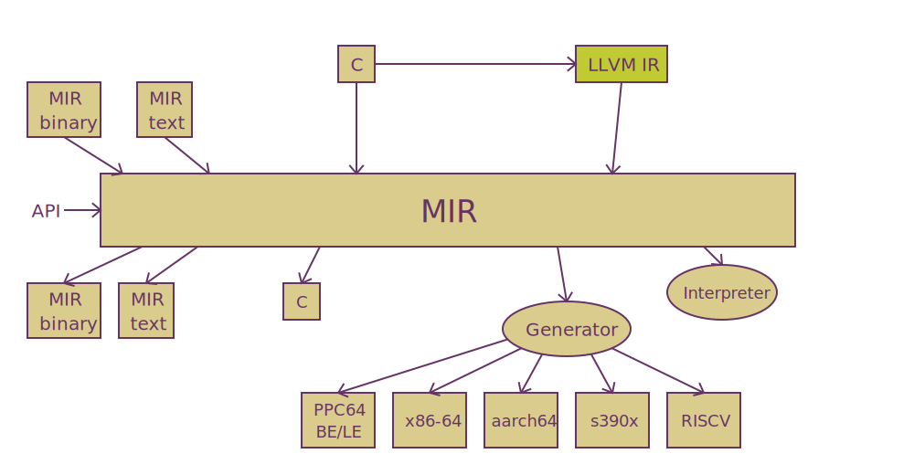
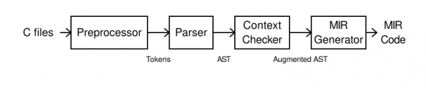
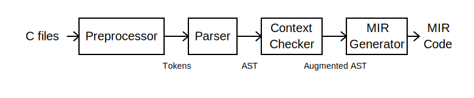

## MIR

项目代码库：https://github.com/vnmakarov/mir

 Medium-level Intermediate Representation

**M**edium **I**ntermediate **R**epresentation 中级别的中间表示

**M**edium **I**nternal **R**epresentation 中级别的内部表示

中级别应该是相对于LLVM中的low level低级别的虚拟机

### 定位

A lightweight JIT compiler project 轻量级的JIT解释器/编译器项目。

### 特点

- 轻量级
- 高性能
- 基于C，不是C++，更轻量，更简单，更容易跟V集成
- 语法设计得很简洁，漂亮，类汇编风格，看着比llvm IR的舒服许多
- 中间表示是MIR，不是SSA，也不是llvm IR
- 生成机器码machine code，不是汇编
- 支持多个架构,x86,arm,risc
- MIT开源协议
- 可看做是一种独立于特定机器的通用汇编语言

总结——除了轻量，MIR 还是该有的都有：

- 它是一种 RTL 表示，也就是 register transfer language （这里的 register 和 local variable 一个意思，最终生成机器码时，会由寄存器分配算法搞定）。
- 它自带了一个轻量的 C11 parser，C 也是它的编译目标之一，所以可以 C -> MIR -> C 的转换。
- 它还可以和 LLVM 中间表示、WebAssembly 互转……
- 它支持对 JIT 语言的特化编译模式：lazy compile，interpret top -> compile function
- 它可以指定不同的优化 level，均衡编译和执行性能
- 现在的缺点：目前只支持64位，32位的支持预计是2022年

### 现在

现有的架构，已经够用了，如果更成熟一些就可以考虑使用。



### 今后

今后会跟四个主流的IR进行转换：

- gcc
- llvm
- wasm
- java bytecode


mir生成机器码过程：


内置的C解释器



### 竞争项目

- [llvm](https://llvm.org/docs/ORCv2.html)

- [gcc](https://gcc.gnu.org/onlinedocs/jit/)

- [QBE](https://c9x.me/compile/)

- [LIBJIT](https://www.gnu.org/software/libjit/)

- [**RyuJIT**](https://github.com/dotnet/coreclr/blob/master/Documentation/botr/ryujit-overview.md)

  

- [libFirm](https://github.com/libfirm/libfirm)

- [CraneLift](https://github.com/CraneStation/cranelift)

- [NanoJIT](https://github.com/dibyendumajumdar/nanojit)

- [Xbyak](https://github.com/herumi/xbyak)

​	而 MIR 和它们的区别是，在保持轻量同时，完成了很多主要的优化：

- SSA: static single assignment，众所周知 Static Single Assignment Book 已经成为编译器新约。但是不用 SSA 表示也能做不少优化。

- Inlining: 内联，也就是把代码撸顺了好执行

- GCSE: 全局的公共子表达式消除

- SCCP: 常量传播并移除控制流图中的死路径

- RA: 可达性分析

- CP: 赋值传播

- DCE: 死代码消除

- LA: 循环分析，可以提取循环不变量等

  


### 安装

#### 代码库下载

git clone https://github.com/vnmakarov/mir.git

#### 编译及安装

```shell
make
make all
make debug

make install
make PREFIX=/usr install
make uninstall
make clean

make test
make bench
```

默认安装目录：

```shell
/usr/local/include
	mir.h, 
	mir-gen.h, 
	c2mir.h
/usr/local/lib
	libmir.a
/usr/local/bin
	c2m
	b2m
	m2b
	b2ctab
```

#### vscode插件

目前就是语法高亮。

名称: [VSCode MIR](https://marketplace.visualstudio.com/items?itemName=eliphatfs0.vscode-mir)

ID: eliphatfs0.vscode-mir

说明: Support for MIR textual format.

版本: 0.0.1

发布者: Flandre Scarlet

### c2m

实现了一个小型的C11标准生成MIR的编译器，把C11代码生成MIR代码。

最小的代码依赖

最简化的代码实现，让代码能够最简单上手，维护

四个阶段：



编译参数：https://github.com/vnmakarov/mir/tree/master/c2mir

```shell
c2m main.c  #默认生成a.bmir二进制格式
-E	#将源代码生成预处理后的代码(也是C代码)
-S	#将C源代码和MIR二进制格式，生成MIR文本格式
-c	#将C源代码，生成MIR二进制格式
-o	#设置输出的文件名，例如main.bmir,main.mir。如果没有设置，则跟C源文件同名。

#运行代码：C代码/二进制格式/文本格式都可以直接运行
-ei #以解释器的方式运行代码
-eg #一次性生成全部的机器码,并运行
-el #以lazy的方式生成机器码，并运行，机器码在每一个函数第一次被调用时，即时生成
-0<n> #MIR-generator生成机器码时，设置的优化级别MIR_gen_set_optimize_level
#可选值：0，1，2(默认)，3，优化级别越高，做的优化越多，生成速度越慢，1比2快50%，2比3快50%
-w	#关闭所有警告信息
-I	#跟C一样，添加包含目录
-fsyntax-only	#只进行语法检查，不生成mir
-fpreprocessed	#忽略预处理过程
...
```

具体示例：

```shell
#编译
c2m sieve.c -E -o s.c
c2m sieve.c -S    
c2m sieve.c -S -o s.mir
c2m sieve.c -c
c2m sieve.c -c -o s.bmir
#运行
c2m sieve.c -ei
c2m sieve.c -eg
c2m sieve.c -el
c2m sieve.c -eg -3
c2m sieve.mir -ei
c2m sieve.bmir -ei
```

#### 主函数main

使用c2m运行mir时，要定义主函数main，否则会提示：

```shell
cannot link program w/o main function
```

#### c2m API

除了使用命令行将C代码生成对应的MIR代码或运行，也可以调用C函数，使用代码来生成，对应的函数在这两个源文件中：

```shell
c2mir/c2mir.c
c2mir/c2mir.h
```

```c
void c2mir_init (MIR_context_t ctx);
void c2mir_finish (MIR_context_t ctx);
int c2mir_compile (MIR_context_t ctx, struct c2mir_options *ops, int (*getc_func) (void *),void *getc_data, const char *source_name, FILE *output_file);
```

### m2b

将文本格式转换为二进制格式

### b2m

将二进制格式转换为文本格式

### b2ctab

将二进制格式转换为C代码

### 语法

#### 特点

- 强类型
- 类似汇编语言的语法，每一个指令或语句都要单独一行
- 跟C语言语法类似的是：变量的类型前置，函数的返回值在前

二进制表示：MIR binary，文件名后缀：.bmir

文本表示：MIR textual，文件名后缀：.mir

#### 实例

C代码：

```c
#define Size 819000
int sieve (int iter) {
  int i, k, prime, count, n; char flags[Size];

  for (n = 0; n < iter; n++) {
    count = 0;
    for (i = 0; i < Size; i++)
      flags[i] = 1;
    for (i = 0; i < Size; i++)
      if (flags[i]) {
        prime = i + i + 3;
        for (k = i + prime; k < Size; k += prime)
          flags[k] = 0;
        count++;
      }
  }
  return count;
}
```

等价的MIR：

```assembly
m_sieve:  module
         export sieve
sieve:    func i32, i32:iter
         local i64:flags, i64:count, i64:prime, i64:n, i64:i, i64:k, i64:temp
         alloca flags, 819000
         mov n, 0
loop:
         bge fin, n, iter
         mov count, 0;   mov i, 0
loop2:
         bgt fin2, i, 819000
         mov ui8:(flags, i), 1;   add i, i, 1
         jmp loop2
fin2:
         mov i, 0
loop3:
         bgt fin3, i, 819000
         beq cont3, ui8:(flags,i), 0
         add temp, i, i;   add prime, temp, 3;   add k, i, prime
loop4:
         bgt fin4, k, 819000
         mov ui8:(flags, k), 0;   add k, k, prime
         jmp loop4
fin4:
         add count, count, 1
cont3:
         add i, i, 1
         jmp loop3
fin3:
         add n, n, 1;  jmp loop
fin:
         ret count
         endfunc
         endmodule
```

#### 上下文 context

- MIR API中都有一个内部的状态，叫MIR context
- 结构体名：MIR_context_t
- context由MIR_init函数创建
- 所有的MIR函数的第一个参数就是context
- 一个context用于一个线程中，不同线程的context不互相影响

#### 程序 program

- 程序由模块组成
- 程序启动前，要调用MIR_init函数，获得context
- MIR_finish：程序退出前，要最后调用MIR_finish函数，释放各种资源
- MIR_output：输出MIR文本表示到指定的文件中
- MIR_scan_string：从字符串中读取MIR文本表示
- MIR_write：将MIR二进制表示写入到指定文件中
- MIR_read：从指定文件中读取MIR二进制表示
- MIR二进制表示比文本表示更精简，运行更快

#### 模块 module

- 模块组成程序

- 模块由项item组成，项有这9种类型
  1. 函数  MIR_func_item
  
  2. 原型  MIR_proto_item
  
  2. 导入  MIR_import_item
  
  3. 导出  MIR_export_item
  
  4. 向前声明  MIR_forward_item
  
  6. 数据  MIR_data_item
  
  7. 引用数据  MIR_ref_data_item
  
  8. 表达式数据  MIR_expr_data_item
  
  9. 内存段数据  MIR_bss_item
  

在一个模块中：函数，原型，导入的命名必须唯一。

#### 函数 function

函数是模块项

每个函数有一个自己专用的栈帧

函数中有局部变量，参数也是局部变量一部分

变量的名字必须在函数中保持唯一

变量包含：名字和类型

函数通过：MIR_new_func创建

函数有明确的函数签名-参数和返回值，函数里包含局部变量和指令

局部变量 local variable

变量有明确的类型，可以是：64位的integer，float，doubule，long double

#### 函数原型 prototype

函数原型proto：就跟C的头文件那样，定义了函数的签名

mir的函数有2种：mir函数，C函数

指令call：不能直接调用函数，而是统一调用函数的原型

函数调用步骤：

- 同模块：

  1. 定义函数原型

  2. 调用函数原型

- 不同模块：

  1. 导出函数
  2. 导入函数
  3. 定义函数原型
  4. 调用函数原型

- 调用C函数

  1. 导入函数

  1. 定义函数原型

  1. 调用函数原型

#### 导入 import

使用import可以导入

- 不同模块的函数

- C函数

默认可以直接导入libc标准库中的函数。

```assembly
#导入libc标准库的函数
import printf
printf_p: proto u64:arg,...
#然后调用
call printf_p, printf, format, a, b, c
```

#### 导出 export

使用export把模块中的函数导出，提供给其他模块使用。

#### 基本数据类型

##### 整数

- MIR_T_I8

- MIR_T_U8

- MIR_T_I16

- MIR_T_U16

- MIR_T_I32

- MIR_T_U32

- MIR_T_I64

- MIR_T_U64

##### 小数

- MIR_T_F

- MIR_T_D

- MIR_T_LD   长双精度数值，依赖于具体平台

##### 指针

- MIR_T_P	指针类型，依赖于具体目标平台，可能是32位或64位

##### 块类型

这个类型只能用于函数的参数。

- MIR_T_BLK         内存块数据，

- MIR_BLK_NUM   目前这个常量是5，块类型的个数一共是6个，从[0..5]

- MIR_T_RBLK      返回的内存块数据

  ```assembly
  MIR_T_BLK .. MIR_T_BLK + MIR_BLK_NUM - 1
  ```
  
  ```assembly
  blk0, blk1, blk2, blk3, blk4, blk5
  rblk
  ```

对应文本格式：i8，u8，i16，u16，i32，u32，i64，u64，f，d，ld，p，blk，rblk

```c
int MIR_int_type_p (MIR_type_t t) //如果是整数则返回TRUE,1

int MIR_fp_type_p (MIR_type_t t) //如果是小数则返回TRUE,1
```

#### 数据类型 data

指定数据类型的数组

```c
MIR_item_t MIR_new_data (MIR_context_t ctx, const char *name, MIR_type_t el_type, size_t nel,const void *els)
```

```assembly
data_name:	u8	4, 0, 0, 0, 8, 8
```

#### 引用数据类型 ref data

引用数据类型，可以引用所有MIR_item_t项目。

通过MIR_new_ref_data函数创建：

```c
MIR_item_t MIR_new_ref_data (MIR_context_t ctx, const char *name, MIR_item_t item,int64_t disp)
```

```assembly
my_ref:	ref	data_name, 0
```

#### 表达式类型 expr data

```c
MIR_item_t MIR_new_expr_data (MIR_context_t ctx, const char *name,MIR_item_t expr_item)
```

```assembly
my_expr:	expr	expr_funcmy_expr:	func	i8, i8, 
```

表达式中的参数必须是函数，并且不是所有的函数都可以作为表达式，必须是：

- 只有1个返回值
- 没有参数
- 内部没有使用函数调用call
- 内部没有使用内存指令

表达式函数在link的时候调用，返回值作为该数据的初始化值。

#### 内存段 memory segment

BSS是英文BlockStarted by Symbol的简称。

bss内存段属于模块级别的，模块内的所有函数都可以访问。

存放程序全局变量的一块内存区域。

```c
MIR_item_t MIR_new_bss (MIR_context_t ctx, const char *name,size_t len)
```

```mir
my_bss:	bss	100
```

#### 向前声明 forward

前向声明（Forward Declaration）

编程语言中，一般规则是所有实体必须在使用前先声明定义。如果是向前声明，则允许在随后的程序中先使用，不过必须在某处提供这个声明的正式定义。

#### 指令 instruction

缩写：insn

指令由opcode(操作码)和operands(操作数)组成

操作码就是指令本身，操作数就是指令的参数

**操作码 opcode**

操作码描述指令做什么事，分为：

- 转换指令 conversion instructions
- 运算指令 arithmetic instructions
- 逻辑指令 logical instructions 
- 比较指令 comparison instructions 
- 分支指令 branch insns
- 组合比较和分支指令 combined comparison and branch instructions
- 函数和方法调用指令 function and procedural call instructions
- 返回指令 return instructions

**操作数 operands**

操作数可以是：局部变量，字面量，内存，标签，引用

内存操作数：类型可以是：8,16,32,64的带符号的和无符号的整数，float，double，ldouble

标签操作数：有一个名字，被流程控制指令使用

引用操作数：被用来引用当前模块中的函数和声明，外部模块，C外部函数或声明

#### 注释

使用#进行单行注释。

### 指令集

指令集中：

- I：表示i64整数，前缀
- S：表示i32整数，**后缀**
- U：表示无符号，前缀
- F：表示单精度小数，前缀
- D：表示双精度小数，前缀
- LD：表示长双精度小数，前缀

#### mov指令

mov指令将源操作数的值复制给目标操作数，一般用于给变量赋值。源操作数不会改变，目标操作数会改变。

| 指令      | 参数个数 | 文本格式 | 描述               |
| --------- | -------- | -------- | ------------------ |
| MIR_MOV   | 2        | mov      | 复制64位整数值     |
| MIR_FMOV  | 2        | fmov     | 复制单精度小数值   |
| MIR_DMOV  | 2        | dmov     | 复制双精度小数值   |
| MIR_LDMOV | 2        | ldmov    | 复制长双精度小数值 |

```assembly
mov	U0_a, U_28
mov	U0_b, 0
```

#### ext指令

扩展就是将数据的字节长度增加，数值仍保持不变。扩展分为：符号扩展和零扩展。

符号扩展通常用于有符号的数字，根据使用的特定有符号数处理方式，通过在数字的最高有效位端添加位数的方式来实现扩展。

零扩展通常用于无符号数字，将目标的高位数设置为零，来实现扩展。

以下指令全部扩展为i64：

| 指令       | 参数个数 | 文本格式 | 描述                 |
| ---------- | -------- | -------- | -------------------- |
| MIR_EXT8   | 2        | ext8     | 符号扩展8位整数      |
| MIR_EXT16  | 2        | ext16    | 符号扩展16位整数     |
| MIR_EXT32  | 2        | ext32    | 符号扩展32位整数     |
| MIR_UEXT8  | 2        | uext8    | 零扩展无符号8位整数  |
| MIR_UEXT16 | 2        | uext16   | 零扩展无符号16位整数 |
| MIR_UEXT32 | 2        | uext32   | 零扩展无符号32位整数 |

```assembly
uext8	I_0, 0
ext32	I_7, i1__t1
```

#### neg指令

取一个数的相反数，就是取反加1

| 指令      | 参数个数 | 文本格式 | 描述                   |
| --------- | -------- | -------- | ---------------------- |
| MIR_NEG   | 2        | neg      | 取64位整数的相反数     |
| MIR_NEGS  | 2        | negs     | 取32位整数的相反数     |
| MIR_FNEG  | 2        | fneg     | 取单精度小数的相反数   |
| MIR_DNEG  | 2        | dneg     | 取双精度小数的相反数   |
| MIR_LDNEG | 2        | ldneg    | 取长双精度小数的相反数 |

```assembly
	local i64:a,i64:b
	mov a, 77
	neg b, a
```

#### add指令

加

| 指令      | 参数个数 | 文本格式 | 描述             |
| --------- | -------- | -------- | ---------------- |
| MIR_ADD   | 3        | add      | 64位整数相加     |
| MIR_ADDS  | 3        | adds     | 32位整数相加     |
| MIR_FADD  | 3        | fadd     | 单精度小数相加   |
| MIR_DADD  | 3        | dadd     | 双精度小数相加   |
| MIR_LDADD | 3        | ldadd    | 长双精度小数相加 |

```assembly
add	I_12, fp, 80
```

#### sub指令

减

| 指令      | 参数个数 | 文本格式 | 描述             |
| --------- | -------- | -------- | ---------------- |
| MIR_SUB   | 3        | sub      | 64位整数相减     |
| MIR_SUBS  | 3        | subs     | 32位整数相减     |
| MIR_FSUB  | 3        | fsub     | 单精度小数相减   |
| MIR_DSUB  | 3        | dsub     | 双精度小数相减   |
| MRI_LDSUB | 3        | ldsub    | 长双精度小数相减 |

```assembly
subs	i_36, i4_j, 1
fsub	f_144, f_142, f_143
dsub	d_13, 1.00000000000000000000000000000000000000000000000000000e+00, d_12
```

#### mul指令

乘

| 指令      | 参数个数 | 文本格式 | 描述             |
| --------- | -------- | -------- | ---------------- |
| MIR_MUL   | 3        | mul      | 64位整数相乘     |
| MIR_MULS  | 3        | muls     | 32位整数相乘     |
| MIR_FMUL  | 3        | fmul     | 单精度小数相乘   |
| MIR_DMUL  | 3        | dmul     | 双精度描述相乘   |
| MIR_LDMUL | 3        | ldmul    | 长双精度小数相乘 |

```assembly
muls	i_10, i2_bi, i0_slen
mul	U_6, U_4, u64:(I_5)
```

#### div指令

除

| 指令      | 参数个数 | 文本格式 | 描述               |
| --------- | -------- | -------- | ------------------ |
| MIR_DIV   | 3        | div      | 64位整数相除       |
| MIR_DIVS  | 3        | divs     | 32位整数相除       |
| MIR_UDIV  | 3        | udiv     | 64位无符号整数相除 |
| MIR_UDIVS | 3        | udivs    | 32位无符号整数相除 |
| MIR_FDIV  | 3        | fdiv     | 单精度小数相除     |
| MIR_DDIV  | 3        | ddiv     | 双精度小数相除     |
| MIR_LDDIV | 3        | lddir    | 长双精度小数相除   |

```assembly
udiv	U_8, U0_z, U_7
udivs	u_42, u0_s2, u32:(I_41)
```

#### mod指令

余

| 指令      | 参数个数 | 文本格式 | 描述                     |
| --------- | -------- | -------- | ------------------------ |
| MIR_MOD   | 3        | mod      | 64位整数相除取余数       |
| MIR_MODS  | 3        | mods     | 32位整数相除取余数       |
| MIR_UMOD  | 3        | umod     | 64位无符号整数相除取余数 |
| MIR_UMODS | 3        | umods    | 32位无符号整数相除取余数 |

```assembly
umods	u_43, u0_out, 10
mods	i_103, i0_exp, 10
```

#### logic指令

位运算：按位且，或，异或

| 指令     | 参数个数 | 文本格式 | 描述             |
| -------- | -------- | -------- | ---------------- |
| MIR_AND  | 3        | and      | 64位整数按位且   |
| MIR_ANDS | 3        | ands     | 32位整数按位且   |
| MIR_OR   | 3        | or       | 64位整数按位或   |
| MIR_ORS  | 3        | ors      | 32位整数按位或   |
| MIR_XOR  | 3        | xor      | 64位整数按位异或 |
| MIR_XORS | 3        | xors     | 32位整数按位异或 |

```assembly
and	U_14, U0_m2, 1
or	U_7, U_3, U_6
xor	U_90, U0_b, U0_seed
```

#### shift指令

位移

把整数，指定方向，移动几位

| 指令      | 参数个数 | 文本格式 | 描述                                 |
| --------- | -------- | -------- | ------------------------------------ |
| MIR_LSH   | 3        | lsh      | 64位整数向左移位                     |
| MIR_LSHS  | 3        | lshs     | 32位整数向左移位                     |
| MIR_RSH   | 3        | rsh      | 64位整数向右移位，带符号扩展         |
| MIR_RSHS  | 3        | rshs     | 32位整数向右移位，带符号扩展         |
| MIR_URSH  | 3        | ursh     | 64位无符号整数向右移位，带无符号扩展 |
| MIR_URSHS | 3        | urshs    | 32位无符号整数向右移位，带无符号扩展 |

```assembly
lsh	U_3, U0_x, U0_s
lshs	i_10, I_9, 8
ursh	U_5, U0_x, U_4
```

#### eq指令

相等

比较2位数值是否相等，相等返回1，不相等返回0

| 指令     | 参数个数 | 文本格式 | 描述                 |
| -------- | -------- | -------- | -------------------- |
| MIR_EQ   | 3        | eq       | 64位整数是否相等     |
| MIR_EQS  | 3        | eqs      | 32位整数是否相等     |
| MIR_FEQ  | 3        | feq      | 单精度小数是否相等   |
| MIR_DEQ  | 3        | deq      | 双精度小数是否相等   |
| MIR_LDEQ | 3        | ldeq     | 长双精度小数是否相等 |

```assembly
eq	i_15, U_14, 0
```

#### ne指令

不相等

比较2位数值是否相等，不相等返回1，相等返回0

| 指令     | 参数个数 | 文本格式 | 描述                   |
| -------- | -------- | -------- | ---------------------- |
| MIR_NE   | 3        | ne       | 64位整数是否不相等     |
| MIR_NES  | 3        | nes      | 32位整数是否不相等     |
| MIR_FNE  | 3        | fne      | 单精度小数是否不相等   |
| MIR_DNE  | 3        | dne      | 双精度小数是否不相等   |
| MIR_LDNE | 3        | ldne     | 长双精度小数是否不相等 |

```assembly
ne	i_6, U_5, 0
```

#### lt指令

小于

| 指令     | 参数个数 | 文本格式 | 描述                       |
| -------- | -------- | -------- | -------------------------- |
| MIR_LT   | 3        | lt       | 64位整数比较是否小于       |
| MIR_LTS  | 3        | lts      | 32位整数比较是否小于       |
| MIR_ULT  | 3        | ult      | 64位无符号整数比较是否小于 |
| MIR_ULTS | 3        | ults     | 32位无符号整数比较是否小于 |
| MIR_FLT  | 3        | flt      | 单精度小数比较是否小于     |
| MIR_DLT  | 3        | dlt      | 双精度小数比较是否小于     |
| MIR_LDLT | 3        | ldlt     | 长双精度小数比较是否小于   |

```assembly
ult	i_12, U0_t, U0_rl
```

#### le指令

小于等于

| 指令     | 参数个数 | 文本格式 | 描述                           |
| -------- | -------- | -------- | ------------------------------ |
| MIR_LE   | 3        | le       | 64位整数比较是否小于等于       |
| MIR_LES  | 3        | les      | 32位整数比较是否小于等于       |
| MIR_ULE  | 3        | ule      | 64位无符号整数比较是否小于等于 |
| MIR_ULES | 3        | ules     | 32位无符号整数比较是否小于等于 |
| MIR_FLE  | 3        | fle      | 单精度小数比较是否小于等于     |
| MIR_DLE  | 3        | dle      | 双精度小数比较是否小于等于     |
| MIR_LDLE | 3        | ldle     | 长双精度比较是否小于等于       |

```assembly
le a, 1, 2
```

#### gt指令

大于

| 指令     | 参数个数 | 文本格式 | 描述                       |
| -------- | -------- | -------- | -------------------------- |
| MIR_GT   | 3        | gt       | 64位整数比较是否大于       |
| MIR_GTS  | 3        | gts      | 32位整数比较是否大于       |
| MIR_UGT  | 3        | ugt      | 64位无符号整数比较是否大于 |
| MIR_UGTS | 3        | ugts     | 32位无符号整数比较是否大于 |
| MIR_FGT  | 3        | fgt      | 单精度小数比较是否大于     |
| MIR_DGT  | 3        | dgt      | 双精度比较是否大约         |
| MIR_LDGT | 3        | ldgt     | 长双精度比较是否大于       |

```assembly
gt b, 1, 2
```

#### ge指令

大于等于

| 指令     | 参数个数 | 文本格式 | 描述                           |
| -------- | -------- | -------- | ------------------------------ |
| MIR_GE   | 3        | ge       | 64位整数比较是否大于等于       |
| MIR_GES  | 3        | ges      | 32位整数比较是否大于等于       |
| MIR_UGE  | 3        | uge      | 64位无符号整数比较是否大于等于 |
| MIR_UGES | 3        | uges     | 32位无符号整数比较是否大于等于 |
| MIR_FGE  | 3        | fge      | 单精度小数比较是否大于等于     |
| MIR_DGE  | 3        | dge      | 双精度比较是否大于等于         |
| MIR_LDGE | 3        | ldge     | 长双精度比较是否大于等于       |

```assembly
ge a, 1, 2
```

#### 类型转换指令

不同类型之间互相转换

##### 整数转小数

| 指令      | 参数个数 | 文本格式 | 描述                             |
| --------- | -------- | -------- | -------------------------------- |
| MIR_I2F   | 2        | i2f      | 64位整数转换成单精度小数         |
| MIR_I2D   | 2        | i2d      | 64位整数转换成双精度小数         |
| MIR_I2LD  | 2        | i2ld     | 64位整数转换成长双精度小数       |
|           |          |          |                                  |
| MIR_UI2F  | 2        | ui2f     | 64位无符号整数转换成单精度小数   |
| MIR_UI2D  | 2        | ui2d     | 64位无符号整数转换成双精度小数   |
| MIR_UI2LD | 2        | ui2ld    | 64位无符号整数转换成长双精度小数 |

```assembly
i2d d, 3
```

##### 小数转整数

| 指令     | 参数个数 | 文本格式 | 描述                       |
| -------- | -------- | -------- | -------------------------- |
| MIR_F2I  | 2        | f2i      | 单精度小数转换成64位整数   |
| MIR_D2I  | 2        | d2i      | 双精度小数转换成64位整数   |
| MIR_LD2I | 2        | ld2i     | 长双精度小数转换成64位整数 |

```assembly
d2i c, 2.12
```

##### 小数转小数

| 指令     | 参数个数 | 文本格式 | 描述                 |
| -------- | -------- | -------- | -------------------- |
| MIR_F2D  | 2        | f2d      | 单精度转换成双精度   |
| MIR_F2LD | 2        | f2ld     | 单精度转换成长双精度 |
| MIR_D2F  | 2        | d2f      | 双精度转换成单精度   |
| MIR_D2LD | 2        | d2ld     | 双精度转换成长双精度 |
| MIR_LD2F | 2        | ld2f     | 长双精度转换成单精度 |
| MIR_LD2D | 2        | ld2d     | 长双精度转换成双精度 |

```assembly
d2f a, 3.13234
```

#### branch指令

##### 基本跳转

| 指令    | 参数个数 | 文本格式 | 描述                               |
| ------- | -------- | -------- | ---------------------------------- |
| MIR_JMP | 1        | jmp      | 无条件跳转到指定的标签             |
| MIR_BT  | 2        | bt       | 当第二个64位整数不为零，跳转到标签 |
| MIR_BTS | 2        | bts      | 当第二个32位整数不为零，跳转到标签 |
| MIR_BF  | 2        | bf       | 当第二个64位整数为零，跳转到标签   |
| MIR_BFS | 2        | bfs      | 当第二个32位整数为零，跳转到标签   |

##### 整数比较跳转

| 指令      | 参数个数 | 文本格式 | 描述                                             |
| --------- | -------- | -------- | ------------------------------------------------ |
| MIR_BEQ   | 3        | beq      | 当最后两个64位整数相等，跳转到标签               |
| MIR_BNE   | 3        | bne      | 当最后两个64位整数不相等，跳转到标签             |
| MIR_BEQS  | 3        | beqs     | 当最后两个32位整数相等，跳转到标签               |
| MIR_BNES  | 3        | bnes     | 当最后两个32位整数不相等，跳转到标签             |
|           |          |          |                                                  |
| MIR_BLT   | 3        | blt      | 当前一个64位整数小于后一个，跳转到标签           |
| MIR_BLE   | 3        | ble      | 当前一个64位整数小于等于后一个，跳转到标签       |
| MIR_UBLT  | 3        | ublt     | 当前一个64位无符号整数小于后一个，跳转到标签     |
| MIR_UBLE  | 3        | uble     | 当前一个64位无符号整数小于等于后一个，跳转到标签 |
| MIR_BLTS  | 3        | blts     | 当前一个32位整数小于后一个，跳转到标签           |
| MIR_BLES  | 3        | bles     | 当前一个32位整数小于等于后一个，跳转到标签       |
| MIR_UBLTS | 3        | ublts    | 当前一个32位无符号整数小于后一个，跳转到标签     |
| MIR_UBLES | 3        | ubles    | 当前一个32位无符号整数小于等于后一个，跳转到标签 |
|           |          |          |                                                  |
| MIR_BGT   | 3        | bgt      | 当前一个64位整数大于后一个，跳转到标签           |
| MIR_BGE   | 3        | bge      | 当前一个64位整数大于等于后一个，跳转到标签       |
| MIR_UBGT  | 3        | ubgt     | 当前一个64位无符号整数大于后一个，跳转到标签     |
| MIR_UBGE  | 3        | ubge     | 当前一个64位无符号整数大于等于后一个，跳转到标签 |
|           |          |          |                                                  |
| MIR_BGTS  | 3        | bgts     | 当前一个32位整数大于后一个，跳转到标签           |
| MIR_BGES  | 3        | bges     | 当前一个32位整数大于等于后一个，跳转到标签       |
| MIR_UBGTS | 3        | ubgts    | 当前一个32位无符号整数大于后一个，跳转到标签     |
| MIR_UBGES | 3        | ubges    | 当前一个32位无符号整数大于等于后一个，跳转到标签 |

```assembly
beq	L131, u64:8(U0_b), 0
```

##### 小数比较跳转

| 指令      | 参数个数 | 文本格式 | 描述                                           |
| --------- | -------- | -------- | ---------------------------------------------- |
| MIR_FBEQ  | 3        | fbeq     | 当2个单精度小数相等，跳转到标签                |
| MIR_FBNE  | 3        | fbne     | 当2个单精度小数不相等，跳转到标签              |
| MIR_DBEQ  | 3        | dbeq     | 当2个双精度小数相等，跳转到标签                |
| MIR_DBNE  | 3        | dbne     | 当2个双精度小数不相等，跳转到标签              |
| MIR_LDBEQ | 3        | ldbeq    | 当2个长双精度小数相等，跳转到标签              |
| MIR_LDBNE | 3        | ldbne    | 当2个长双精度小数不相等，跳转到标签            |
|           |          |          |                                                |
| MIR_FBLT  | 3        | fblt     | 当前一个单精度小数小于后一个，跳转到标签       |
| MIR_FBLE  | 3        | fble     | 当前一个单精度小数小于等于后一个，跳转到标签   |
| MIR_DBLT  | 3        | dblt     | 当前一个双精度小数小于后一个，跳转到标签       |
| MIR_DBLE  | 3        | dble     | 当前一个双精度小数小于等于后一个，跳转到标签   |
| MIR_LDBLT | 3        | ldblt    | 当前一个长双精度小数小于后一个，跳转到标签     |
| MIR_LDBLE | 3        | ldble    | 当前一个长双精度小数小于等于后一个，跳转到标签 |
|           |          |          |                                                |
| MIR_FBGT  | 3        | fbgt     | 当前一个单精度小数大于后一个，跳转到标签       |
| MIR_FBGE  | 3        | fbge     | 当前一个单精度小数大于等于后一个，跳转到标签   |
| MIR_DBGT  | 3        | dbgt     | 当前一个双精度小数大于后一个，跳转到标签       |
| MIR_DBGE  | 3        | dbge     | 当前一个双精度小数大于等于后一个，跳转到标签   |
| MIR_LDBGT | 3        | ldbgt    | 当前一个长双精度小数大于后一个，跳转到标签     |
| MIR_LDBGE | 3        | ldbge    | 当前一个长双精度小数大于等于后一个，跳转到标签 |

```assembly
fbeq	L2431, f0_x, f_0
```

#### call指令

调用函数

不确定个数参数

参数1：原型

参数2：函数地址，可以是导入的C函数，也可以是其他模块导出的MIR函数

参数3：可选，函数的返回值

剩下的：函数调用的参数

```assembly
call	proto9, array_push_many, U0_b, U0_ptr, i0_len
```

#### inline指令

跟call指令类似，跟C的inline函数一样，把函数的调用层级缩短。

指令格式就跟调用函数原型一样：

```assembly
inline	proto1, __darwin_check_fd_set, i_0, i0__fd, U_1
```

#### switch指令

分支指令，类似match多分支语句

MIR_SWITCH

- 第一个参数是0至N-1的整数值
- 剩下的是N个参数，N>0
- 根据第一个参数的值，返回后面参数中的第N-1个
- 如果第一个参数超过N-1，则返回undefined

```assembly
switch	I_198, L4097, L4098, L4097, L4097, L4097, L4097
```

#### ret指令

MIR_RET

返回

返回指令可以有0或多个参数

返回指令要跟函数的签名一样

```assembly
ret	I_2, I_3
```

#### alloca指令

在函数栈上分配内存区域，用来存储引用类型的局部变量，指向堆的数据。

参数1：内存地址，起始指针

参数2：内存大小，以字节为单位

然后就可以开始对这个fp的内存区域进行读写

```assembly
alloca	fp, 16 #分配内存区域，fp为起始指针
mov	i32:(fp), 1	#开始写入值，写入i32，4个字节
mov	i32:4(fp), 2 #偏移4个字节，继续写入i32,4个字节
```

#### label指令

跳转标签

```assembly
		jmp	L123
L122:
L123:
```

#### block指令

| 指令       | 参数个数 | 文本格式 | 描述       |
| ---------- | -------- | -------- | ---------- |
| MIR_BSTART | 1        | bstart   | 代码块开始 |
| MIR_BEND   | 1        | bend     | 代码块结束 |

#### 参数相关指令

下面的指令只能用于函数参数，主要用来支持C函数中的不确定个数参数，参考C标准库的<stdarg.h>。

| 指令             | 参数个数 | 文本格式     | 描述                                     |
| ---------------- | -------- | ------------ | ---------------------------------------- |
| MIR_VA_ARG       | 3        | va_arg       | 返回内存指针，2个参数：va_list和内存指针 |
| MIR_VA_BLOCK_ARG | 3        | va_block_arg | 返回内存地址，2个参数：va_list和整数     |
| MIR_VA_START     | 1        | va_start     | 参数是* va_list结构体指针                |
| MIR_VA_END       | 1        | va_end       | 参数是* va_list结构体指针                |

### C集成

在MIR中可以通过import指令来导入C函数，并且通过call指令来调用，

这样就实现了C代码集成，可以使用C世界丰富的资源。

```assembly
m:  module
	
		import printf 	#导入libc的函数
p_printf: proto u64:p,...	#printf函数原型

main: func
    local i64:a, i64:b, i64:c
    mov a, 1
    mov b, 3
    mov c, 0
    add c, a, b
    call p_printf, printf, format, a, b, c #调用函数
    endfunc
    endmodule
```

### 代码执行

#### 代码解释执行

```c
void MIR_interp (MIR_context_t ctx, MIR_item_t func_item, MIR_val_t *results, size_t nargs,...);
void MIR_interp_arr (MIR_context_t ctx, MIR_item_t func_item, MIR_val_t *results,size_t nargs, MIR_val_t *vals);
```

#### 代码编译执行

```c
void MIR_gen_init (MIR_context_t ctx, int gens_num)
void *MIR_gen (MIR_context_t ctx, int gen_num, MIR_item_t func_item)
```

示例代码：

```v
	result := Val{}
	args := c.new_val_arr(Val{ i: 5 })
	// start load -> link -> interpret -> return result
	c.load_external('printf', C.printf)
	c.load_module(m)
	c.link()
	// run with JIT
	c.gen_init(2)
	c.gen_set_optimize_level(1, 3)
	c.gen(1, main_fn)
	// each generator instance can be used in a different thread to compile different MIR functions
	// c.gen(1, other_fn)

	// interpret from main_fn with arg i, and return result
	c.interp(main_fn, &result, args)
	println('main_fn returns: $result.i')
	c.gen_finish()
	c.finish()
```

### 当前性能指标

Intel i7-9700K with 16GB memory under FC29 with GCC-8.2.1

|                 | MIR-gen         | MIR-interp   | gcc -O2           | gcc -O0       |
| --------------- | --------------- | ------------ | ----------------- | ------------- |
| compilation [1] | **1.0** (69us)  | 0.17 (12us)  | **193** (13.35ms) | 186 (12.8ms)  |
| compilation [2] | **1.0** (116us) | 0.10 (12us)  | **115** (13.35ms) | 110 (12.8ms)  |
| execution [3]   | **1.0** (3.05s) | 6.0 (18.3s)  | **0.95** (2.9s)   | 2.08 (6.34s)  |
| code size [4]   | **1.0** (325KB) | 0.51 (165KB) | **76** (25.2MB)   | 76 (25.2MB)   |
| startup [5]     | **1.0** (1.3us) | 1.0 (1.3us)  | **9310** (12.1ms) | 9850 (12.8ms) |
| LOC [6]         | **1.0** (15.8K) | 0.59 (9.4K)  | **94** (1480K)    | 94 (1480K)    |

### 踩坑记录

- mir代码中，如果最后一行没有添加一个新行，会报错：

  ```shell
  ln 68: endmodule should have no params
  ln 68: absent endmodule
  ```


### 参考资料

英文资料：https://developers.redhat.com/blog/2020/01/20/mir-a-lightweight-jit-compiler-project

中文资料: https://zhuanlan.zhihu.com/p/162111478


